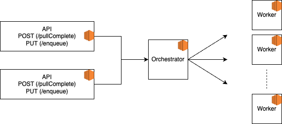

# Cloud Computing Exe2 - Dynamic Workload

## Members

Linoy Elimeleh 319122610

Harel Damari 305792020

Daniel Sehaik 308223965

---

## Architecture
Our architecture contains 3 services:
1. API Service: 2 running instances responsible to transfer request from user to orchestrator service.
2. Orchestrators Service: Processes all requests and scales workers to manage API load. 
3. Worker Service - This is the component responsible for the job itself. When we scale up the number of workers we can process more parallel jobs.

 

---

## How to run?
Run the "init.sh" script to deploy all instances.
Make sure bash and AWS CLI exist on your machine.
After instances are up, can validate using AWS console or AWS CLI, 
You should have 4 running instances: 2 API's, 1 Orchestrator and 1 Worker.
When load increases the number of workers should increase as well while remianing the minimum of 1 worker.

---
## Failure Modes

### Single Point of Failure
Our orchestrator is a single point of failure. If for some reason this instance fails we won't be able to process new jobs and our API will fail as well and return 500.
This can be mitigated using some sort of pub/sub architecture instead or using kafka with replication and scaled with multiple partitions.

### Disaster Recovery
Our data is not persisted and kept in memory. In real production system we won't be able to recover data if the orchestrator fails or even in case one workers fail during process.
Moreover, the deployment is across a single DS (depends on aws configuration) - this means that even if we add a DB and in some way handle worker failures, we won't be able to recover from such scenario.

### Network Failure
Our communication in our flow is fully synchronous. In case of request failure / instance failure we can lose a workload.
This can be handled using Kafka exactly once semantics.
https://www.confluent.io/blog/exactly-once-semantics-are-possible-heres-how-apache-kafka-does-it/

### Instance Recovery
Currently, if some instance fails we have no guarantee for it to spawn back.
This can be handled using a container orchestration system such as K8S.

### Memory / CPU
Choosing proper resources for an instance is an art for itself. Currently, we used default t2 instance for all services.
In real world we would like to tune our resources.

### Monitoring
One of the most important things in BE development. Real world production systems require monitoring - we should monitor api calls, error codes, requests, instance failures, run times.
Moreover, it would be great to add logs to elastic so they can be filtered using kibana.
For handling metrics we can use prometheus and grafana and would add alerts to be sent to mail/phone/work messenger.

### Testing
In real world system we would expect the code to be fully tested with unit and integration tests.
We would also suggest including automation tests to check the entire flow.

### Security
We did not expose any credential during our project. Nonetheless, cyber threats are a real issue dealing with production system and a DO/Cyber team should mitigate this issue and make sure that by using rules and policies they mitigate the attack surface as much as possible.